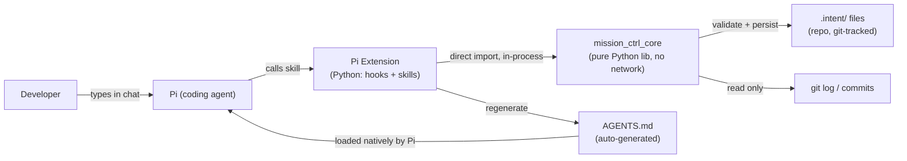
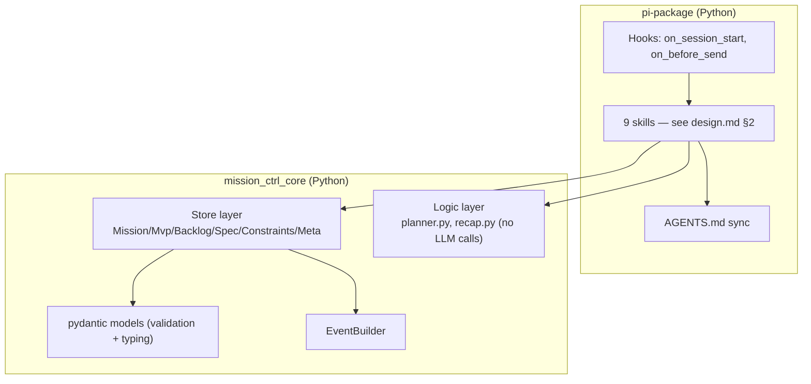
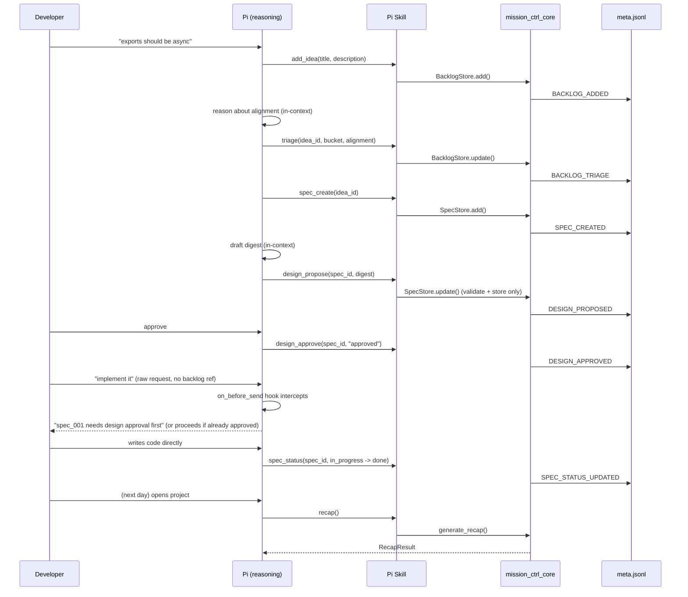
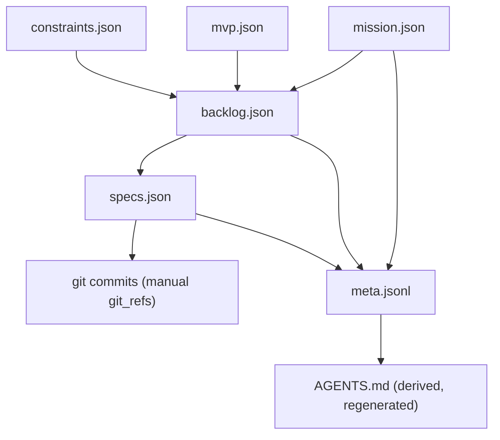

# Mission Ctrl — Architecture
## v1 scope: Pi extension, pure Python core. No Claude plugin, no MCP, no bridge.
Status: current source of truth. Supersedes the architecture sections of
`mission-ctrl-technical-roadmap.md`, `mission-ctrl-common.md`,
`mission-ctrl-claude-plugin.md`, `mission-ctrl-pi-package.md` (all deleted — see roadmap.md
for what's deferred and why).

---

## 1. System Context



No subprocess boundary, no external network call anywhere. Pi is the only LLM in the system — it reasons in its own context; core only validates and persists what Pi tells it.

---

## 2. Component Diagram



Two packages, one language, one process. `mission_ctrl_core` stays a separate pip package so it's reusable later — see §6 for the cost of reusing it from a non-Python surface.

---

## 3. Data Flow — Core Loop



---

## 4. Data Model Relationships



File format (JSON/JSONL) is language-agnostic by design — see `docs/examples/domain/` for live samples. This is unchanged regardless of core implementation language.

---

## 5. Repository Layout

```
mission-ctrl/
├── packages/
│   ├── core/                     # mission_ctrl_core (Python, pip)
│   │   ├── mission_ctrl_core/
│   │   │   ├── models/           # pydantic models (replaces old *.schema.json + AJV)
│   │   │   ├── store/            # IntentStore + sub-stores
│   │   │   ├── logic/            # planner.py, recap.py
│   │   │   └── events/           # EventBuilder
│   │   ├── tests/
│   │   │   └── fixtures/         # empty-project, mid-flight, complex-graph
│   │   └── pyproject.toml
│   │
│   └── pi-package/               # mission_ctrl_pi (Python, depends on core)
│       ├── mission_ctrl_pi/
│       │   ├── extension.py
│       │   ├── hooks/
│       │   │   ├── on_session_start.py
│       │   │   └── on_before_send.py
│       │   ├── skills/
│       │   └── sync/agents_md_sync.py
│       ├── templates/AGENTS.md
│       └── pyproject.toml
│
├── docs/
│   ├── concept.md
│   ├── architecture.md           # this file
│   ├── design.md
│   ├── roadmap.md
│   ├── scratchpad.md
│   └── examples/
│
└── README.md
```

Runtime layout inside a user's project is unchanged: `.intent/*.json`, `.intent/meta.jsonl`, `AGENTS.md` at repo root, committed to git.

---

## 6. Deferred Cost (accepted, not resolved)

Building a Claude Code plugin later means either:
- (a) a Node → Python subprocess bridge (mirror image of the bridge we removed), or
- (b) porting `mission_ctrl_core` to TypeScript, duplicating it.

Not a v1 decision. Revisit only when the Claude plugin is actually scheduled — see `roadmap.md` Backlog.
