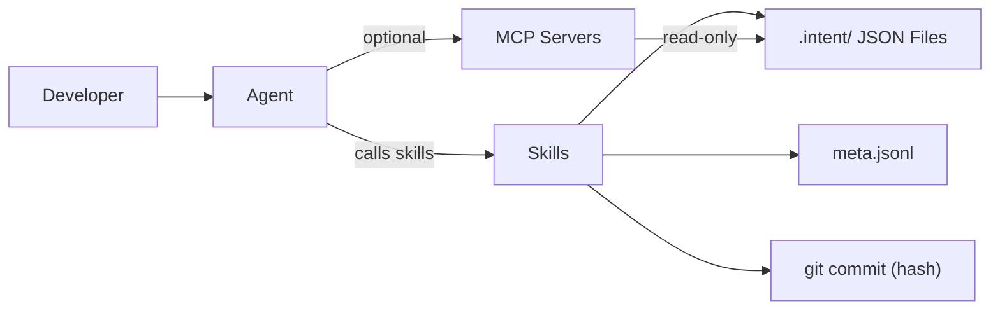
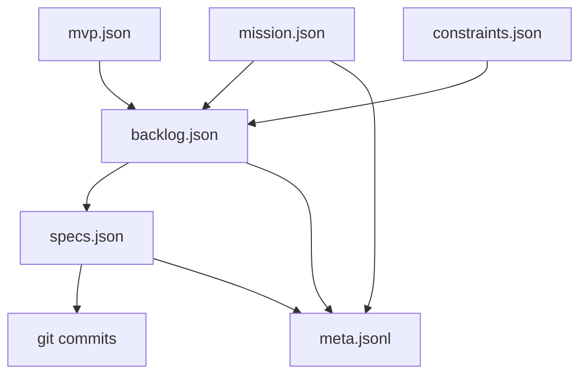
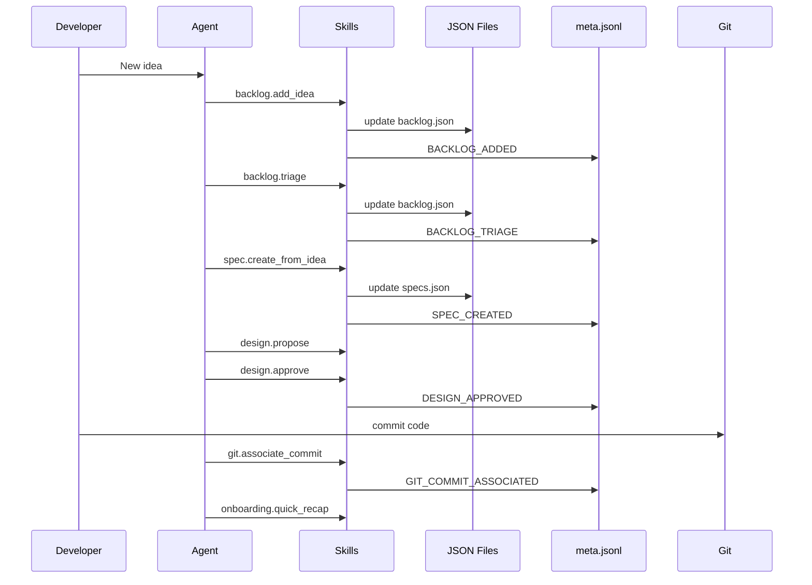

# Intent-Driven, Spec-Aware Development Assistant (VS Code First)
Version: 0.2 (Implementation Draft)
Owner: (you)
Last updated: 2026-03-20

---

## 0) Purpose of This Document
This document consolidates all decisions and details into a single implementation-oriented spec. It is intended to be the working reference for building:
- VS Code integration
- MCP servers / skills
- Data model and persistence
- Agent interaction patterns

---

## 1) Abstract (Intent of the Tool)

### 1.1 Problem Statement
AI-assisted coding increases output velocity but also increases:
- **scope creep** (adding low-value features because they're easy to generate)
- **loss of mission alignment** (work drifts away from the original end-to-end goal)
- **planning overhead** (humans manually decide “what’s next” repeatedly)
- **review friction** (hard to review design changes at the right time)
- **re-entry cost** (after a break, it’s hard to regain context and resume optimally)

Existing “spec-driven development” (SDD) tooling improves local alignment between spec ↔ code, but does not provide a first-class system for:
- mission/MVP alignment over time
- backlog-first arbitration
- dependency-aware prioritization
- lightweight onboarding and drift control inside the IDE

### 1.2 Solution Overview
Build an **Intent Layer** that integrates into users’ existing VS Code agent workflow via **skills/tools** (likely MCP servers) rather than replacing their IDE or coding agent.

Core behavior:
- Treat **Mission → MVP → Constraints** as authoritative project intent.
- Force **Backlog-first** for all new ideas/features.
- Operate as a **Minimalist Enforcer**: default posture is “protect focus, reduce complexity, defer distractions,” while allowing explicit user overrides.
- Provide **quick recap onboarding** when returning after time away.
- Maintain **spec dependency graph** so prioritization and “what next” can be dependency-aware.
- Add **human-in-the-loop design gates** to reduce review friction.

### 1.3 Design Philosophy
- Integrate, don’t replace: works with existing agents in VS Code.
- Strict structure for reliability; natural language CRUD for usability.
- Minimal UX; speak only at decision boundaries.
- Store state in small, diffable artifacts; store history as structured events.

---

## 2) Features of the Tool (What It Does)

### 2.1 Intent Management (First-Class)
Artifacts:
- Mission statement (what success means end-to-end)
- MVP definition (what must exist for “product stands up”)
- Constraints (engineering guardrails; e.g., keep architecture simple, avoid elaborate tests initially)

Behavior:
- Any feature/idea is evaluated against these artifacts.
- Intent changes are explicit and tracked, not accidental.

### 2.2 Backlog-First Idea Capture + Arbitration
Behavior:
- Any new idea is captured to backlog by default.
- Tool categorizes ideas into buckets (examples):
  - MVP-critical (should be scheduled soon)
  - Parked / Nice-to-have (defer until MVP is stable)
  - Archived / Not aligned (out of mission or violates constraints)
- Tool can:
  - merge/club similar items
  - retire items that are no longer relevant
  - surface items later when “timing is right” (e.g., after dependencies or milestones)

### 2.3 Minimalist Enforcer + Override Model
Default:
- Prevents non-MVP or high-complexity work from becoming the “current focus” unintentionally.

Override model (hybrid):
- Small exception → allow as one-time without changing intent.
- Big exception → prompt collaborative renegotiation (update mission/MVP/constraints).
- Repeated pattern → propose intent update because user behavior indicates changed priorities.

### 2.4 Prioritization + “What Next” Guidance
Behavior:
- Suggest next spec/feature based on:
  - MVP alignment
  - dependency unblocking
  - complexity/risk
  - current focus continuity (minimize context switching)
- Human stays in control:
  - agent proposes ranked options + rationale
  - user picks or overrides

### 2.5 Spec Dependency Graph (First-Class)
Behavior:
- Specs/features exist as nodes with explicit dependencies.
- Tool prevents implementing blocked nodes without an explicit override.
- Re-planning is supported: user can reorder, rewire dependencies, split/merge nodes.

### 2.6 Design Gate + Digestible Review
Before implementation:
- Generate a short design digest (one pager):
  - proposed architecture changes
  - impacted modules
  - main risks
  - open questions
- User can approve, modify, or reject.
- This becomes an explicit “gate” before writing code.

### 2.7 Quick Recap Onboarding (Return After Time Away)
When user opens project after time away or starts a new session:
- Mission reminder (1–2 lines)
- MVP status snapshot
- Top constraints
- Last active focus (what was being implemented)
- What changed since last session (from meta event log and git history)
- Top recommended next steps (2 items) + rationale

### 2.8 Lightweight IDE Dashboard (Later UX)
Requirements:
- Extremely light; must render inside VS Code/Electron.
- Presents:
  - intent summary (mission/MVP/constraints)
  - Now (current focus)
  - Next (top suggestions)
  - Backlog buckets
  - drift indicators (optional)

Non-requirement for v1:
- no heavy PM UI
- no complex drag-and-drop editor required initially

---

## 3) Specifications (Derived from Discussion)

### 3.1 Primary Use Cases (Original)
1. Adjust future specs even when sequential implementation intent exists.
2. “Next feature” should be intuitive; reduce manual selection burden.
3. Design review/interjection should be easy and digestible.
4. Visual block view of design/spec graph (lightweight) for preview and tweaks.

### 3.2 Intent Alignment Use Cases (Added Later)
- Prevent low-value additions from consuming time.
- Reduce anxiety that optimization/vision is being lost.
- Provide arbitration/prioritization like a common-sense PM + Scrum Master.
- Backlog-first with timing-aware resurfacing.
- Merge/retire ideas as relevance changes.

### 3.3 Non-Goals (Explicit)
- Do not replace VS Code.
- Do not require users to adopt a new agent runtime.
- Do not become a full Jira/Linear replacement.
- Do not enforce heavy ceremonies or formal frameworks.
- Do not be verbose or overly conversational.

### 3.4 Agent Personality Constraints (Tone/Behavior)
- Professional, direct, minimal.
- Speaks only at decision boundaries:
  - new idea capture
  - feature triage and planning
  - misalignment detection
  - before implementation
  - session onboarding
- Always provides clear options:
  - implement now / park / archive / adjust intent

---

## 4) Data Model / Schema (Implementation‑Oriented)

### 4.1 Purpose of the Data Model

The data model is the **single source of truth** that makes intent‑driven development possible. It exists to provide durable, inspectable, machine‑readable project state so that:

- The **agent cannot rely on chat history** or implicit assumptions.
- The **human can correct** the agent and the workflow at any time.
- The system can enforce **Mission → MVP → Constraints** consistently across sessions.
- The workflow can support **backlog-first arbitration**, **dependency-aware planning**, and **low-friction re-entry**.

Without this data model, the system collapses into “prompt-and-pray” behavior:
- intent becomes fuzzy,
- prioritization becomes ad‑hoc,
- and returning after a break becomes expensive.

The data model is therefore not just persistence—it is the **coordination and enforcement substrate** for the entire workflow.

---

### 4.2 What the Data Model Must Enable (Responsibilities)

The data model must support five concrete responsibilities:

#### (R1) Represent **Current Truth**
Store the current authoritative state for:
- Mission statement
- MVP definition
- Constraints
- Backlog items + current classification
- Spec graph nodes + dependencies + statuses

These answer: *“What is true right now?”*

#### (R2) Preserve **Decision Context**
For any meaningful change, it must be possible to answer:
- Why was this idea parked?
- Why was this spec prioritized?
- Why did the MVP change?
- Which constraints applied when we made this choice?

These answer: *“Why is it true?”*

#### (R3) Enable **Agent Enforcement**
The agent must be able to deterministically:
- validate alignment to mission/MVP/constraints
- prevent skipping backlog-first workflow
- refuse/flag implementing blocked specs
- propose next steps based on dependency graph + priority

This requires structured data, not prose.

#### (R4) Enable **Human Correction and Override**
Humans must be able to:
- inspect state quickly
- understand past rationale quickly
- override agent decisions intentionally
- edit state directly (with validation), if desired

This requires small, diffable artifacts with strong validation.

#### (R5) Enable **Re-entry / Onboarding**
When the user returns after time away, the system must generate:
- what changed since last session
- what the current focus is
- what is recommended next
- how those recommendations tie to mission/MVP

This requires structured history with linkage, not scattered notes.

---

### 4.3 What the Data Model Explicitly Does NOT Do (Non-Responsibilities)

To avoid overbuilding, the data model is not responsible for:

- Event-sourcing the full system state (no “replay to reconstruct state” requirement)
- Embedding business logic (logic lives in MCP servers / skills)
- Replacing git history
- Being a full project management system (no sprints/epics/reporting as first-class)
- Storing large design docs (store references/links instead)

The model stores **facts (state)** and **decisions (why)**—not execution logic.

---

### 4.4 Core Design: Separate State vs History (Why This Split Exists)

We deliberately separate:

| Concern | Stored Where | Why |
|---|---|---|
| Current truth (small, bounded) | Domain JSON files | Fast inspection, diffable, stable |
| Decision rationale + linkage | `meta.jsonl` | Onboarding, explainability, traceability |
| Enforcement logic | MCP servers / skills | Replaceable, testable, tool-agnostic |
| UX surfaces | VS Code extension (thin) | Minimal UI, optional |

This prevents failure modes:
- bloated state files
- “history mixed into state”
- agent guessing intent from chat
- hard-to-debug prioritization

---

### 4.5 Storage Layout (Repo Local, VS Code Friendly)

All artifacts live in the repository for portability and git-based review.

Recommended structure:

- `.intent/`
  - `mission.json`
  - `mvp.json`
  - `constraints.json`
  - `backlog.json`
  - `specs.json`
  - `meta.jsonl`
  - `schemas/`
    - `mission.schema.json`
    - `mvp.schema.json`
    - `constraints.schema.json`
    - `backlog.schema.json`
    - `specs.schema.json`
    - `meta.schema.json`

All files are **strictly validated** using JSON Schema. Tooling must refuse invalid writes.

---

### 4.6 Global Canonical IDs (Locked Decision)

All entities across all domain files and events use global canonical IDs.

Examples:
- Mission: `mis_001`
- MVP item: `mvp_012`
- Constraint: `con_007`
- Backlog idea: `idea_104`
- Spec node: `spec_058`
- Event: `evt_000391`

Why:
- Simplifies linking across separate files
- Makes meta events stable references (no ambiguity)
- Enables cross-tool interoperability
- Avoids fragile “file-scoped ID + file path” coupling

---

### 4.7 Domain State Files (What Is True Now)

Each file represents one bounded concept and contains only **current state**.

#### 4.7.1 `mission.json`
Purpose:
- Capture the mission statement as the highest-priority intent.
- Provide the stable anchor against which features are judged.

Minimum contents (conceptual):
- `id`, `version`, `statement`, optional `success_criteria`, timestamps.

#### 4.7.2 `mvp.json`
Purpose:
- Define what “standing up the product” means.
- Convert mission into a concrete must-have set.

Minimum contents:
- MVP items with `id`, `title`, `description`.
- Optional mapping to specs for traceability: `linked_specs`.

#### 4.7.3 `constraints.json`
Purpose:
- Encode guardrails that shape implementation choices.
- Prevent accidental architecture/test/process expansion.

Minimum contents:
- Constraints with `id`, `rule`, `rationale`, `severity`, `scope`.

#### 4.7.4 `backlog.json`
Purpose:
- The single inventory of ideas/features/tasks.
- Enforce “backlog-first” capture and classification.
- Track lifecycle and links to specs/MVP items.

Minimum contents:
- Backlog items with `id`, `title`, `description`, `bucket`, `alignment`, `links`, timestamps.

Buckets (conceptual):
- `mvp_critical`
- `parked`
- `archived`

#### 4.7.5 `specs.json` (Canonical Spec Graph; Locked Decision)
Purpose:
- Represent specs as nodes with explicit dependencies and status.
- Enable dependency-aware planning and sequencing.
- Enable re-planning by editing the graph.

Minimum contents:
- Nodes with `id`, `title`, `status`, `depends_on[]`, `links` to backlog/MVP.

Canonical dependency graph rule:
- `specs.json` is the authoritative graph.
- `meta.jsonl` records why and when changes were made.

---

### 4.8 Meta Event Log (`meta.jsonl`) — Why Things Changed

The meta event log is a structured, append-only set of decision records.

It exists to:
- support re-entry: *“what changed since I last worked?”*
- support explainability: *“why did we park/merge/prioritize this?”*
- support collaborative renegotiation: *“what intent was active when we changed direction?”*
- support decision dependency: *“this decision depends on earlier decision X”*

#### Why JSONL
- Append-only writes
- Easy filtering by time/entity/event_type
- Supports “delta since last session” efficiently
- Does not bloat state files

#### Event is a decision artifact (not state diff)
Events do not replace domain state. They explain changes and provide linkage and rationale.

#### Enforcement requirements (Locked)
Each event must be validated and include at least:
- `event_id`
- `timestamp`
- `event_type`
- `affected_entities` (typed references to global IDs)
- `linked_intent` (mission/MVP/constraints identifiers/versions)
- `reasoning` (human understandable, concise)
- optional: `depends_on[]`, `supersedes`

Event examples (conceptual):
- `BACKLOG_ADDED`
- `BACKLOG_TRIAGE`
- `BACKLOG_MERGED`
- `BACKLOG_ARCHIVED`
- `SPEC_CREATED`
- `SPEC_DEPENDENCY_UPDATED`
- `DESIGN_APPROVED`
- `INTENT_UPDATED`
- `OVERRIDE_ACCEPTED`

---

### 4.9 Strict Validation and Write Rules (B1)

Strict schema enforcement is mandatory because:
- the agent must not hallucinate structure
- broken state causes cascading failures (wrong prioritization, wrong onboarding)
- humans need reliable diffable artifacts

Rules:
- All domain file writes must pass JSON Schema validation.
- All meta events must pass event schema validation.
- Tooling should refuse invalid writes and surface a targeted error.

---

### 4.10 How the Data Model Drives the Workflow (Practical Mapping)

This is how the data model supports the core workflow loop:

1) **New idea arrives**
- Stored in `backlog.json` (new item).
- `meta.jsonl` records capture + triage decision with reasoning.

2) **Prioritization / “what next”**
- Computed from:
  - `mvp.json` alignment
  - `specs.json` unblocked nodes
  - `backlog.json` bucket + priority tags
- Chosen work item becomes “Now”; decision recorded in `meta.jsonl`.

3) **Before implementation**
- `specs.json` consulted to ensure dependencies are satisfied.
- Design proposal/approval recorded in `meta.jsonl`.

4) **During implementation**
- Spec status transitions are written to `specs.json`.
- Significant decisions appended to `meta.jsonl`.

5) **Returning after time away**
- Quick recap generated by reading:
  - current state (domain files)
  - changes since last session (filtered meta events and associated git commits)

The data model is what makes this durable and consistent across sessions and tools.

---

## 5. Implementation and Deployment

### 5.1 Overall Implementation Strategy

The system is implemented as a **skills‑first intent layer** that integrates into a developer’s existing VS Code workflow and existing coding agents.

The core design principle is:

> **All critical functionality must work with lightweight agent skills alone.**  
> MCP servers are optional and additive, used only for richer interaction and polish.

This ensures:
- low adoption friction,
- compatibility with a wide range of agents,
- and a clear separation between **core correctness** and **UX enhancements**.

---

### 5.2 Skills‑First Architecture (Primary Path)

#### What “skills” mean in this context
A *skill* is a discrete, callable capability exposed to the agent, such as:
- “add idea to backlog”
- “triage backlog item”
- “suggest next work”
- “generate onboarding recap”
- “propose design for spec”

Skills:
- operate on repository state (`.intent/` files),
- are stateless between calls,
- enforce validation and guardrails,
- and return structured results plus human‑readable explanations.

Skills are the **primary drivers of workflow correctness**.

---

### 5.3 Optional MCP Usage (Secondary Path)

MCP servers are **not required** for the system to function.

They may be introduced later to support:
- interactive visualizations (e.g. spec dependency blocks),
- richer dashboards,
- drag‑and‑drop reordering,
- persistent UI state across sessions.

Important constraint:
> **No core logic, enforcement, or correctness depends on MCP availability.**

If MCP is unavailable, the workflow must still:
- enforce backlog‑first behavior,
- protect mission/MVP alignment,
- generate onboarding recaps,
- manage spec dependencies via files.

---

### 5.4 Target Environment

#### Primary target (v1)
- VS Code (desktop)
- Local, single‑developer repository

#### Assumptions
- Repository is writable.
- `.intent/` directory exists at repo root.
- Agent can:
  - read and write files,
  - call skills/tools,
  - display structured responses to the user.

#### Explicit non‑goals (v1)
- Multi‑user real‑time collaboration
- Cloud hosting requirement
- Central SaaS backend
- Authentication or permissions

---

### 5.5 High‑Level Component Breakdown

The implementation consists of four logical layers:

1. **VS Code surface**
   - Commands and minimal panels
   - No business logic

2. **Coding agent**
   - Existing agent chosen by the user
   - Executes skills and presents results

3. **Skill implementations**
   - Core decision logic
   - Validation and enforcement
   - Reads/writes `.intent/` state

4. **Repository state**
   - Domain JSON files
   - `meta.jsonl` decision log
   - Git history (commits)

The repository is the **single source of truth**.

---

### 5.6 Core Skill Groups

Skills are grouped by responsibility. Each group may be implemented as a module, package, or service, but remains conceptually separate.

---

#### 5.6.1 Intent & Backlog Skills

**Primary responsibility:**  
Manage project intent and backlog arbitration.

These skills implement the **PM + Scrum‑master logic**.

##### Responsibilities
- Read and update:
  - mission
  - MVP
  - constraints
- Capture all ideas into backlog
- Classify backlog items into buckets
- Merge, park, or archive items
- Suggest prioritized next steps
- Generate onboarding recaps
- Record all decisions into `meta.jsonl`

##### Example skill operations
- `intent.get`
- `intent.update`
- `backlog.add_idea`
- `backlog.triage`
- `backlog.merge`
- `backlog.archive`
- `planner.suggest_next`
- `onboarding.quick_recap`

##### Enforcement rules
- No idea may be implemented without backlog capture.
- Mission and MVP cannot change implicitly.
- All decisions must include human‑readable reasoning.

---

#### 5.6.2 Spec Graph Skills

**Primary responsibility:**  
Manage implementation structure and dependencies.

##### Responsibilities
- Create and update spec nodes
- Maintain canonical dependency graph in `specs.json`
- Identify blocked vs unblocked specs
- Prevent illegal graph mutations
- Update spec lifecycle status
- Record structural changes to `meta.jsonl`

##### Example skill operations
- `spec.create_from_idea`
- `spec.add_dependency`
- `spec.remove_dependency`
- `spec.list_unblocked`
- `spec.update_status`

##### Enforcement rules
- Dependencies must be explicit.
- Cycles are rejected.
- Blocked specs cannot be implemented without override.

---

#### 5.6.3 Design Gate Skills

**Primary responsibility:**  
Ensure human‑in‑the‑loop design review before code changes.

##### Responsibilities
- Generate short design digests for a spec
- Highlight:
  - architectural impact
  - risk areas
  - open questions
- Capture explicit approval or revision
- Record outcomes in `meta.jsonl`

##### Example skill operations
- `design.propose`
- `design.approve`
- `design.revise`

##### Constraints
- Digests must be concise.
- No generic or boilerplate questions.
- No code generation responsibility.

---

### 5.7 Git History Integration (Recorded Change)

Git is treated as a **first‑class context source**, especially for onboarding and auditability.

#### Role of git history
- Git commits represent *what actually changed*.
- Meta events represent *why decisions were made*.
- Onboarding correlates both.

#### Implementation implications
- Skills may read git history (e.g. `git log`) to:
  - summarize recent changes,
  - associate commits with specs or backlog items,
  - enrich onboarding recaps.

- Meta events may optionally include:
  - commit hashes,
  - commit ranges,
  - branch references.

Git does not replace meta events; it complements them.

---

### 5.8 Agent Interaction Contract (Skills‑Based)

To maintain correctness across agents, a small set of **mandatory interaction rules** is required.

#### Required behaviors

1. **Session start**
   - Call onboarding recap skill.
   - Present output before work begins.

2. **New idea or feature request**
   - Call backlog add skill.
   - Call triage skill.
   - Do not implement immediately.

3. **Before implementation**
   - Call planner suggest skill.
   - Require user confirmation or override.

4. **Before writing code**
   - Call design propose skill.
   - Require explicit approval.

5. **During work**
   - Update spec status.
   - Record significant decisions.

Agents that skip these steps undermine system guarantees.

---

### 5.9 Validation and Failure Handling

#### Validation rules
- All domain JSON files must pass schema validation.
- All meta events must pass event schema validation.
- Invalid writes are rejected.

#### Failure philosophy
- Fail early and explicitly.
- Provide actionable error messages.
- Never silently correct or infer intent.

Example:
> “Spec dependency update rejected: cycle detected between spec_012 and spec_008.”

---

### 5.10 Deployment Model (v1)

- Local installation only.
- Skills run locally.
- VS Code extension provides command surface.
- All state lives in the repository.
- No network dependency required.

Deferred explicitly:
- Shared servers
- Cloud sync
- Multi‑user arbitration

---

### 5.11 Summary

This implementation approach ensures that:

- **Correctness is skill‑driven**, not UI‑driven.
- **Intent enforcement does not depend on MCP**.
- **Git, structured state, and human judgment are first‑class**.
- The system remains lightweight, inspectable, and adoptable.

This section defines **how the system is built and deployed**, independent of agent choice.

---

## 6. Design and Architecture

### 6.1 Architectural Goals

The architecture is designed to satisfy the following goals:

- Enforce **mission‑aligned development** over time, not just per change.
- Keep the **human firmly in the loop** at key decision boundaries.
- Avoid dependence on chat history or agent memory.
- Integrate into existing VS Code workflows with minimal friction.
- Remain inspectable, debuggable, and correctable by developers.
- Scale in sophistication without forcing early complexity.

The system is intentionally **not optimized for autonomy**. It is optimized for **clarity, control, and durability of intent**.

---

### 6.2 High‑Level Architectural Overview

The system consists of four cooperating layers:

1. **Developer interaction layer (VS Code)**
2. **Coding agent layer**
3. **Skill execution layer**
4. **Persistent state + history layer (repo + git)**

Each layer has a single responsibility and minimal coupling to others.

---

### 6.3 Layer 1: Developer Interaction (VS Code)

#### Purpose
Provide a lightweight surface for:
- triggering skills,
- viewing onboarding recaps,
- reviewing design digests,
- and inspecting intent state.

#### Design principles
- VS Code UI is **thin and optional**.
- No business logic lives here.
- UI elements map directly to skills.

#### Examples
- Command palette actions:
  - “Intent: Quick Recap”
  - “Intent: Add Idea”
  - “Intent: Suggest Next”
- Optional side panel:
  - shows mission, MVP status, current focus, backlog buckets

The system must remain fully usable even if the user interacts only through agent chat.

---

### 6.4 Layer 2: Coding Agent

#### Role of the agent
The coding agent acts as:
- an **orchestrator of skills**,
- a presenter of structured results,
- and an executor of code changes.

The agent is **not the source of truth** and **not the decision authority**.

#### Key constraints
- The agent must follow the interaction contract defined in Section 5.
- The agent must not:
  - infer intent implicitly,
  - bypass backlog or design gates,
  - or modify state without validated skill calls.

The architecture assumes agents are replaceable and imperfect.

---

### 6.5 Layer 3: Skills (Core Logic)

#### Why skills are the core abstraction
Skills are the **primary enforcement mechanism** because they:
- are simple to integrate across agents,
- are stateless and testable,
- operate directly on repo state,
- and can fail safely with validation.

All correctness guarantees live here.

#### Skill responsibilities (recap)
- Validate intent alignment.
- Enforce backlog‑first behavior.
- Compute prioritization and sequencing.
- Manage spec dependencies.
- Generate onboarding recaps.
- Record decision rationale.

Each skill:
- reads from domain JSON files,
- writes validated updates,
- appends structured events to `meta.jsonl`,
- optionally reads git history.

---

### 6.6 Optional MCP Layer (Enhancement Only)

#### Role of MCP (explicitly non‑core)
MCP is an **optional enhancement layer** used for:
- interactive visualizations,
- richer dashboards,
- drag‑and‑drop dependency editing,
- long‑lived UI state.

#### Architectural constraint
> No core logic or enforcement may live exclusively in MCP servers.

If MCP is removed:
- skills must still function,
- intent enforcement must still hold,
- onboarding must still work.

MCP improves **experience**, not **correctness**.

---

### 6.7 Layer 4: Persistent State and History

This layer is the **foundation of durability**.

It consists of two complementary parts:
1. Structured intent state
2. Git history

---

#### 6.7.1 Structured Intent State (`.intent/`)

Purpose:
- Store current truth and decision rationale.

Components:
- Domain JSON files:
  - mission
  - MVP
  - constraints
  - backlog
  - specs (dependency graph)
- `meta.jsonl`:
  - append‑only decision events
  - rationale, linkage, dependencies between decisions

Key property:
- Inspectable and diffable without special tooling.

---

#### 6.7.2 Git History as First‑Class Context

Git is treated as **authoritative evidence of what actually changed**.

#### Why git matters
- Code is the ultimate outcome of decisions.
- Git already encodes:
  - sequence,
  - scope,
  - and authorship of changes.

The architecture explicitly combines:
- **meta events** → why decisions were made
- **git commits** → what was implemented

---

### 6.8 Correlating Meta Events and Git Commits

#### Conceptual model
- Meta events explain intent and decisions.
- Git commits implement those decisions.

The system supports **association**, not duplication.

#### Association mechanisms
- Meta events may reference:
  - commit hashes,
  - commit ranges,
  - branches.
- Skills may infer associations by:
  - touched files ↔ spec nodes,
  - timing proximity,
  - explicit user confirmation.

This correlation is especially important for:
- onboarding recaps,
- auditability,
- and understanding drift.

---

### 6.9 Onboarding Architecture (Return‑After‑Time‑Away)

Onboarding is generated by combining:

1. **Current state**
   - mission
   - MVP
   - constraints
   - active specs

2. **Decision history**
   - recent meta events since last session

3. **Implementation history**
   - recent git commits
   - inferred or explicit associations

This allows the system to answer:
- What was the intent?
- What decisions were made?
- What actually changed?
- What remains most valuable to do next?

Onboarding is not a summary; it is a **re‑anchoring mechanism**.

---

### 6.10 Decision Boundaries as Architectural Anchors

The architecture is organized around **decision boundaries**, not tasks.

Examples:
- Adding a new idea
- Selecting what to implement next
- Approving a design
- Overriding intent
- Returning after time away

At each boundary:
- a skill is invoked,
- validation occurs,
- reasoning is recorded,
- and the human is explicitly involved.

This is the core mechanism that prevents drift.

---

### 6.11 Separation of Concerns (Explicit)

| Concern | Layer |
|------|------|
| Intent definition | Domain JSON |
| Prioritization logic | Skills |
| Dependency management | Skills + specs.json |
| Rationale and history | meta.jsonl |
| Implementation | Git commits |
| Presentation | VS Code UI |
| Orchestration | Agent |

This separation is deliberate and enforced.

---

### 6.12 Architectural Non‑Goals

The architecture explicitly avoids:
- full event sourcing
- autonomous planning without confirmation
- opaque agent memory
- heavy UI frameworks
- centralized servers in v1

Complexity is introduced only when it provides clear leverage.

---

### 6.13 Summary

This architecture ensures that:

- **Intent is durable** across time and sessions.
- **Agents are constrained**, not trusted blindly.
- **Humans remain in control**, but with reduced cognitive load.
- **Git and structured state work together**, not separately.
- **The system can grow**, without being overbuilt upfront.

This section defines *how the system holds together*, independent of specific skills or schemas.

---
## 7. Decision Log

This section records **explicit, durable decisions** made during the design process.  
It exists to prevent accidental regression, reinterpretation, or silent scope drift during implementation.

Each decision here is considered **binding** unless intentionally revisited and superseded by a new entry.

---

### 7.1 Product and Workflow Decisions

#### 7.1.1 Intent Hierarchy (Locked)
All decision-making is governed by the following priority order:

1. **Mission statement**  
   Defines the end‑to‑end problem the project exists to solve.

2. **MVP definition**  
   Defines what “standing up the product” means in concrete terms.

3. **Constraints**  
   Define guardrails on architecture, process, and engineering tradeoffs.

All features, specs, and ideas are evaluated against this hierarchy.

---

#### 7.1.2 Backlog‑First Workflow (Locked)
- All ideas must enter the system via the backlog.
- No idea is implemented directly.
- Backlog items are explicitly classified into:
  - MVP‑critical
  - Parked (nice‑to‑have, later)
  - Archived (misaligned or obsolete)

This is the primary mechanism for preventing scope creep.

---

#### 7.1.3 Agent Posture: Minimalist Enforcer (Locked)
- Default posture is to protect focus and simplicity.
- The agent actively flags misalignment and premature work.
- The agent does not silently proceed on questionable actions.

---

#### 7.1.4 Override Model: Hybrid (Locked)
- Small overrides may be treated as one‑off exceptions.
- Large overrides trigger collaborative renegotiation of intent.
- Repeated overrides cause the system to suggest updating mission/MVP/constraints.

The system adapts to user intent changes without assuming them.

---

#### 7.1.5 Onboarding Mode: Quick Recap (Locked)
When returning after time away, onboarding must:
- Be concise and calming.
- Re‑anchor the user to mission and MVP.
- Explain what changed and why.
- Recommend the most valuable next step.

This replaces reliance on memory or chat history.

---

### 7.2 Data Model and Persistence Decisions

#### 7.2.1 Separate Domain State and History (Locked)
- Current state lives in separate JSON domain files.
- Decision history lives in an append‑only `meta.jsonl`.

State answers *what is true*.  
Meta events answer *why it is true*.

---

#### 7.2.2 Global Canonical IDs (Locked)
- All entities use globally unique, stable IDs.
- IDs are shared across domain files and meta events.

This enables reliable linking, auditing, and tool interoperability.

---

#### 7.2.3 Spec Dependency Graph Canonical in `specs.json` (Locked)
- Spec nodes and dependencies live in `specs.json`.
- Meta events record rationale for changes.
- Dependencies are editable and inspectable.

This avoids implicit sequencing and mental tracking.

---

#### 7.2.4 Strict Schema Enforcement (Locked)
- All domain JSON files must pass JSON Schema validation.
- All meta events must pass event schema validation.
- Invalid writes are rejected.

Correctness is enforced structurally, not socially.

---

### 7.3 Integration and Architecture Decisions

#### 7.3.1 Skills‑First Architecture (Locked)
- Lightweight agent skills are the primary integration mechanism.
- All core logic must work with skills alone.

This maximizes compatibility and minimizes adoption friction.

---

#### 7.3.2 MCP as Optional Enhancement (Locked)
- MCP servers are optional.
- MCP is used only for richer interaction and polish:
  - visualizations
  - interactive rearrangement
  - advanced dashboards

No correctness or enforcement depends on MCP availability.

---

#### 7.3.3 Git History as First‑Class Context (Locked)
- Git commits are treated as authoritative evidence of implementation.
- Onboarding correlates:
  - meta events (decisions)
  - git history (actual changes)

Git complements structured intent state; it does not replace it.

---

### 7.4 Explicit Non‑Goals (Locked)

The system explicitly does **not** aim to:
- Replace VS Code or existing coding agents.
- Become a full project management system.
- Enforce rigid PM frameworks or ceremonies.
- Operate autonomously without human confirmation.
- Centralize state in a SaaS backend (v1).

---

## Appendix A: Example Quick Recap Output (Target)

This appendix illustrates the intended *shape and tone* of onboarding output.

- **Mission**  
  Build X that does Y end‑to‑end for Z users.

- **MVP Status**  
  3 of 5 required capabilities implemented.  
  Remaining: Export flow, Error handling.

- **Constraints**  
  Keep architecture simple.  
  Avoid elaborate testing until core flows stabilize.

- **Last Focus**  
  `spec_012` – Async export pipeline (design approved, implementation in progress).

- **What Changed Since Last Session**  
  - Parked 2 backlog items (low MVP impact).  
  - Approved design for `spec_012`.  
  - 4 commits touching export and queue modules.

- **Recommended Next Step**  
  Finish `spec_012` to unblock remaining MVP flows.

---

## Appendix B: Backlog Classification Semantics

This appendix clarifies the meaning of backlog buckets.

### MVP‑Critical
- Directly required to stand up the product.
- Often unblock other work.
- Should be prioritized unless explicitly deferred.

### Parked
- Potentially valuable.
- Not required for MVP.
- Intentionally deferred to protect focus.

### Archived
- Misaligned with mission.
- Redundant with other work.
- No longer relevant given current direction.

Archiving is not deletion; it is an explicit decision.

---

## Appendix C: Git and Meta Event Correlation Model

This appendix explains how git history and meta events work together.

### Conceptual Split
- **Meta events** capture *why* decisions were made.
- **Git commits** capture *what* actually changed.

Neither replaces the other.

---

### Association Mechanisms
Meta events may optionally reference:
- commit hashes
- commit ranges
- branch names

Skills may also infer associations based on:
- files touched by commits
- mapping between files and spec nodes
- timing proximity
- explicit user confirmation

---

### Onboarding Usage
Onboarding logic combines:
- current intent state
- recent meta events
- recent git commits

This enables accurate re‑entry without guesswork.

---

### Non‑Goals
- Git history is not rewritten.
- Commits are not auto‑generated.
- Meta events do not attempt to fully mirror git.

Correlation is additive, not duplicative.

---

## 8. End‑to‑End Lifecycle Walkthrough (Coexisting with Agent Memory)

This section walks through a complete end‑to‑end lifecycle **using the exact JSON artifacts defined earlier**, while explicitly showing how this workflow **coexists with long‑term agent memory** rather than replacing or reusing it.

Key premise:

> **Agent memory and this workflow serve different purposes and operate in parallel.**

- **Agent memory** optimizes continuity, personalization, and conversational fluency.
- **This workflow** optimizes mission alignment, prioritization discipline, and re‑entry clarity.

The two reinforce each other but are not coupled.

---

### 8.1 Conceptual Model: Two Parallel Memory Planes

Before the walkthrough, it is important to clarify the mental model.

#### Agent Memory (unchanged)
- Stores conversational context.
- Learns user preferences and coding style.
- Remembers past interactions and patterns.
- Is opaque, probabilistic, and agent‑specific.

#### Intent Workflow State (this system)
- Stores **explicit, inspectable project intent**.
- Stores **decisions, rationale, and task structure**.
- Is deterministic, versioned, and repo‑local.
- Does not depend on agent recall.

The workflow **does not attempt to “outsmart” or replace agent memory**.  
It provides a **stable reference frame** that the agent can consult regardless of what it remembers.

---

### 8.2 Step 1 — Project Initialization (Explicit Intent Anchor)

#### Situation
A new project is started. The agent may have general memory about the user, but no durable project‑specific anchor yet.

#### Action
The developer defines:
- mission (`mission.json`)
- MVP (`mvp.json`)
- constraints (`constraints.json`)

These files establish **explicit project intent**, independent of agent memory.

#### Meta event
A meta event (`INTENT_CREATED`) is appended to `meta.jsonl`.

#### Why this complements agent memory
- The agent may remember *what the user usually builds*.
- The workflow records *what this specific project is trying to accomplish*.
- If agent memory is lost, reset, or replaced, intent remains intact.

---

### 8.3 Step 2 — Idea Capture (Backlog‑First, Memory‑Agnostic)

#### Situation
The developer thinks:
> “Exports should run asynchronously.”

The agent might already understand this from context or prior discussion.

#### Action
Regardless of agent memory, the agent must:
- call `backlog.add_idea`
- write a new entry to `backlog.json`

A `BACKLOG_ADDED` event is appended to `meta.jsonl`.

#### Why this complements agent memory
- Agent memory may *remember* the idea.
- The workflow **guarantees it is captured structurally**.
- This prevents reliance on “the agent will remember later”.

Memory is helpful; structure is reliable.

---

### 8.4 Step 3 — Triage and Prioritization (Explicit Decision Boundary)

#### Situation
The agent evaluates the idea.

Agent memory may help with nuance, but **it does not make the decision alone**.

#### Action
The agent calls `backlog.triage` using:
- `mission.json`
- `mvp.json`
- `constraints.json`

`backlog.json` is updated (e.g., `mvp_critical`), and a `BACKLOG_TRIAGE` event records the reasoning.

#### Why this complements agent memory
- Memory can influence *how reasoning is phrased*.
- The workflow determines *what the outcome is and why*.
- The decision is now durable and reviewable.

---

### 8.5 Step 4 — Spec Creation (From Idea to Structured Work)

#### Situation
An idea is confirmed as MVP‑critical.

#### Action
The agent calls `spec.create_from_idea`.

`specs.json` gains a new node (`spec_001`), and a `SPEC_CREATED` meta event is written.

#### Memory interaction
- The agent may remember the discussion that led here.
- The workflow encodes the result as a **dependency‑aware artifact**.

This ensures future planning does not depend on recall.

---

### 8.6 Step 5 — Design Gate (Human Authority, Not Memory)

#### Situation
Implementation is about to begin.

#### Action
The agent calls `design.propose`.
A design digest is generated and reviewed.

Approval is recorded via a `DESIGN_APPROVED` meta event.

#### Why memory is not enough here
- Agent memory might remember past preferences.
- This workflow ensures **explicit approval for this spec**.
- Architectural intent is recorded, not inferred.

---

### 8.7 Step 6 — Implementation and Ongoing Agent Memory

#### Situation
The developer writes code.

#### Interaction between systems
- Agent memory helps with:
  - recalling previous code patterns
  - stylistic consistency
  - conversational continuity
- The workflow tracks:
  - spec status (`specs.json`)
  - decision milestones (`meta.jsonl`)

These systems run in parallel.

---

### 8.8 Step 7 — Git Commit Association (Objective Reality)

#### Situation
Code is committed.

#### Action
A `GIT_COMMIT_ASSOCIATED` meta event links:
- a spec ID
- a commit hash

#### Why this matters even with memory
- Agent memory might recall “we implemented async exports”.
- Git + meta events prove **exactly what changed and why**.
- This is critical for onboarding and auditability.

---

### 8.9 Step 8 — A New Idea Appears (Memory‑Safe Deferral)

#### Situation
The developer thinks:
> “A progress bar would be nice.”

The agent may remember this suggestion later.

#### Action
The workflow:
- captures the idea in `backlog.json`
- triages it as `parked`
- records reasoning in `meta.jsonl`

#### Outcome
- The idea is not forgotten.
- The agent is free to focus on current work.
- No anxiety about “will the agent remember this later?”

---

### 8.10 Step 9 — Developer Leaves, Agent Memory Persists (Maybe)

#### Situation
The developer leaves the project for days or weeks.

#### Reality
- Agent memory may or may not persist.
- The agent may be upgraded, reset, or replaced.

#### Guarantee
The workflow state remains complete and readable:
- domain JSON files
- meta events
- git history

This is intentional redundancy.

---

### 8.11 Step 10 — Returning After Time Away (Structured Re‑Anchoring)

#### Situation
The developer opens the project again.

#### Action
The agent calls `onboarding.quick_recap`.

#### Inputs
1. **Structured state** (mission, MVP, specs)
2. **Decision history** (`meta.jsonl`)
3. **Git commits** (via hashes in meta events)
4. **Optional agent memory**, if available

#### Output
- Mission reminder
- MVP progress
- Last active spec
- What changed and why
- Recommended next step

#### Key point
- The recap does **not depend on agent memory**.
- If memory exists, it enhances explanation quality.
- If memory is gone, correctness is unaffected.

---

### 8.12 Why This Coexistence Works

This architecture deliberately avoids a false choice between:
- “trust the agent’s memory” and
- “externalize everything”.

Instead:
- **Agent memory handles continuity and fluency**
- **The workflow handles alignment and discipline**

They complement each other without coupling.

---

### 8.13 End‑to‑End Invariant (Revised)

If agent memory is lost, the project still explains itself.  
If agent memory persists, the experience becomes smoother.

The system is correct **without memory**, and better **with memory**.

That is the intended design.

---

## 9. v1 Skill Surface, Optional MCP Servers, and Workflow Diagrams

This section finalizes the **operational surface** of the system:
- the complete and minimal **v1 skill set**
- the **optional MCP servers** (non‑core, enhancement only)
- visual **workflow diagrams** showing how everything fits together

This section is intended to be the **handoff point to a coding agent**.

---

## 9.1 Final v1 Skill Surface (Exhaustive and Verified)

The following skills constitute the **entire required surface for v1**.

If a skill is not listed here, it is **not required for correctness**.

Each skill has:
- a single responsibility
- a clear boundary
- an obvious mapping to domain files

---

### 9.1.1 Intent & Backlog Skills

These skills enforce **mission alignment and scope discipline**.

1. **`intent.get`**  
   Read current project intent:
   - `mission.json`
   - `mvp.json`
   - `constraints.json`

2. **`intent.update`**  
   Explicitly update mission, MVP, or constraints.  
   This is the *only* way intent changes.

3. **`backlog.add_idea`**  
   Capture a new idea into `backlog.json` (untriaged).

4. **`backlog.triage`**  
   Classify an idea as:
   - `mvp_critical`
   - `parked`
   - `archived`  
   Records reasoning to `meta.jsonl`.

5. **`planner.suggest_next`**  
   Recommend the most valuable next spec using:
   - MVP alignment
   - dependency status
   - current focus

---

### 9.1.2 Spec & Execution Structure Skills

These skills manage **how work is structured and sequenced**.

6. **`spec.create_from_idea`**  
   Create a spec node in `specs.json` from a prioritized backlog item.

7. **`spec.list_unblocked`**  
   Identify specs whose dependencies are satisfied.

8. **`spec.update_status`**  
   Track lifecycle transitions:
   - `draft`
   - `in_progress`
   - `done`

---

### 9.1.3 Design Gate Skills

These skills enforce **human‑in‑the‑loop review**.

9. **`design.propose`**  
   Generate a concise design digest for a spec.

10. **`design.approve`**  
    Record explicit human approval or required changes.

---

### 9.1.4 Context & Onboarding Skills

These skills reduce **re‑entry cost and ambiguity**.

11. **`git.associate_commit`**  
    Link a spec to a **single git commit hash**.

12. **`onboarding.quick_recap`**  
    Generate re‑entry context using:
    - domain JSON state
    - recent `meta.jsonl` events
    - associated git commits

---

### ✅ v1 Skill Invariant

If **all 12 skills** above are implemented correctly:
- mission drift is controlled
- scope creep is contained
- dependencies are explicit
- re‑entry cost is low

Anything beyond this is **optional enhancement**.

---

## 9.2 Optional MCP Servers (Enhancement Only)

MCP servers are **explicitly not required** for correctness.

They exist only to improve **interaction quality and visualization**.

---

### 9.2.1 MCP Server: Visual Spec Graph

**Purpose**
- Render `specs.json` as an interactive graph
- Allow visual dependency inspection
- Optionally support drag‑and‑drop dependency editing

**Reads**
- `specs.json`

**Writes (via skills only)**
- Dependency changes routed through `spec.*` skills

---

### 9.2.2 MCP Server: Dashboard / Overview

**Purpose**
- Render a lightweight dashboard in VS Code
- Show:
  - mission summary
  - MVP progress
  - current focus
  - backlog buckets

**Reads**
- `mission.json`
- `mvp.json`
- `backlog.json`
- `specs.json`

**Constraint**
- Dashboard is read‑only in v1

---

### MCP Non‑Negotiable Rule

> No MCP server may contain core logic or enforcement.  
> All writes must flow through skills.

---

## 9.3 Diagram 1 — High‑Level Workflow (5‑Minute Mental Model)

## 9.4 Diagram 2 — Data Model Relationships

## 9.5 Diagram 3 — End‑to‑End Lifecycle (Concrete Flow)

